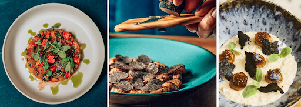

# Carrousel du restaurant Bonnard



## Carrousel > Alternatives des images

**Problème**

- **1.1 :** Absence d'alternative textuelle pour les images au sein du carrousel, regroupées au sein de `role="group"`

**Solution**

- Ajouter, en tant que valeur dans l’attribut alt sur ``, des alternatives pertinentes pour chaque image porteuse d’information ex: `"Photo XX"`, où `XX` reprend quelques termes pour expliquer l’info dans la photo : `alt="Photo risotto à la truffe"`

## Carrousel > Navigation

**Problème**

- **13.10 :** Présence d’une fonctionnalité utilisable seulement au moyen d’un geste complexe : navigation possible dans le carrousel uniquement avec un swipe (déplacement avec la souris sur les contenus)

- **13.8 :** Présence d'un contenu en mouvement qui n'est pas contrôlable par l'utilisateur : Les images du carrousel défile automatiquement.

**Solution**

- S'assurer de bien pouvoir naviguer dans le carrousel avec un geste simple (Un geste simple implique un contact en un point unique de l'écran).  
Proposition de correction avec des boutons "Suivant" et "Précédent" :
    - Ajouter des éléments `<button type="button">` permettant de naviguer dans le carrousel positionnés après les images du carrousel
    
    - Les photos du carrousel non visible ou partiellement visible ont un attribut `aria-hidden="true"` positionné sur l'élément parent `<div role="group" aria-label="X/Y">`
    
    - Ces boutons de navigation doivent avoir un intitulé pertinent du type `"Photo suivante"` / `"Photo précédente"`
        - Si vous souhaitez utiliser seulement une icône visible pour les boutons (ex : flèches droite / gauche), alors :
            - ajouter les intitulés `"Photo suivante / précédente"` au sein d’un élément `<span>` visuellement masqué (ex : `sr-only`)
            - Masquer l'icône avec un attribut `aria-hidden="true"`
        
    ```html
        <button type="button">
            <svg aria-hidden="true">
            <span class="sr-only">Photo suivante</span>
        </button>
    ```
    - Lors de l’activation d’un bouton de navigation :

        - afficher visuellement la ou les nouvelle.s photo.s

        - positionner le focus sur la première nouvelle photo rendu visible, en ajoutant, préalablement, un attribut `tabindex="-1"` sur la `<div role="group" aria-label="X/Y">` et en y positionnant le focus via JavaScript

- **Concernant le mouvement automatique :**
    - Nous vous préconisons de ne pas faire défiler le carrousel automatiquement, mais uniquement via les boutons de navigation

    - **Soit** ajouter un bouton `<button type="button">` qui permet de faire pause/lecture sur le contenu, positionné avant le carrousel
        - L’élément a un intitulé pertinent du type `"Mettre le carousel en pause"` / `"Relancer l'animation automatique du carrousel"`

**Remarque :** Veillez à bien vérifier que tous les boutons fonctionnent au clavier, les rendre activables avec les touches `Entrée` et `Espace` et s'assurer de la bonne visibilité du focus clavier et de donner des intitulés pertinents aux boutons.